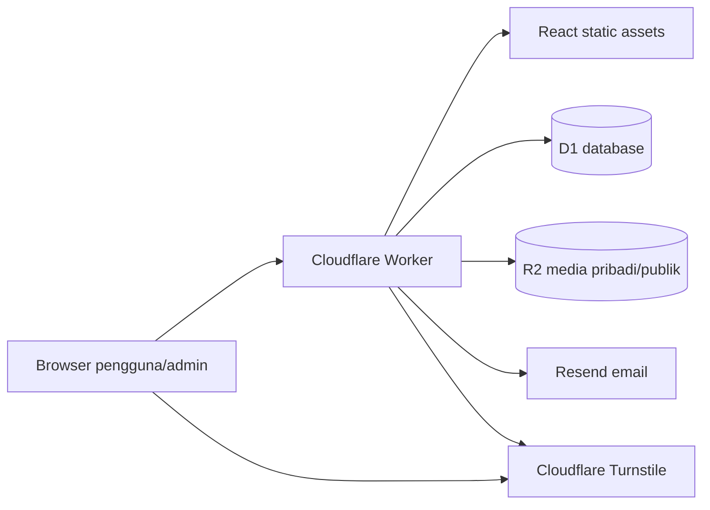
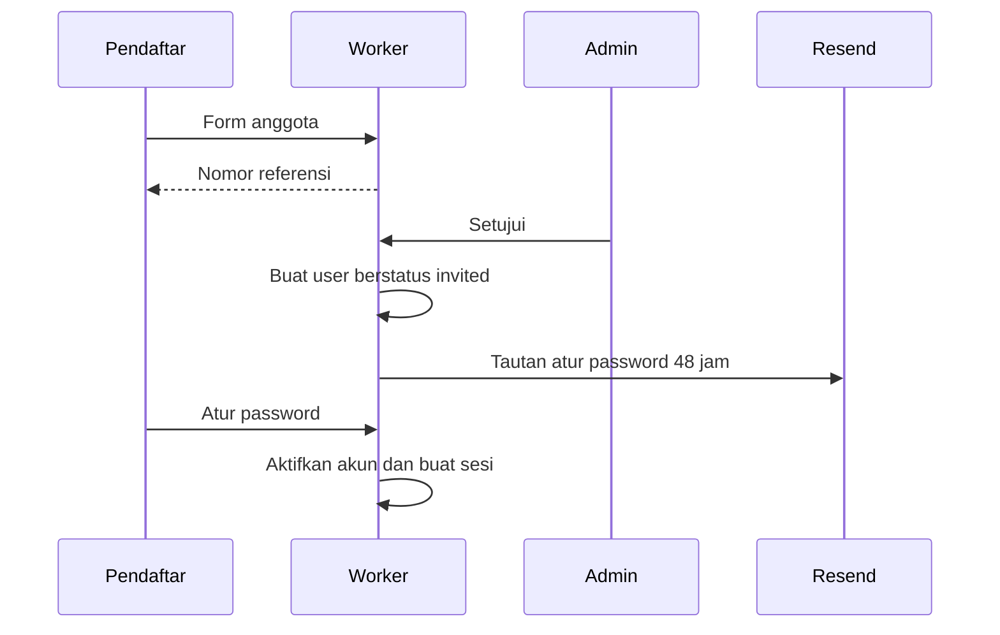

# Arsitektur

Worker dan frontend menggunakan origin yang sama. Semua perubahan data melewati `/api/*`; browser tidak memiliki kredensial D1, R2, atau Resend.

## Data dan akses

- `news` dan `scholarships` dapat dibaca publik setelah diterbitkan.
- Form publik menghasilkan nomor referensi acak. Pemeriksaan status memerlukan nomor referensi dan email.
- `sessions` menyimpan hash token; browser menerima cookie HTTP-only dengan masa berlaku 12 jam.
- `auth_tokens` menyimpan hash undangan dan reset sekali pakai.
- Endpoint `/api/admin/*` memeriksa sesi dan peran admin di server.
- Gambar berita dibaca publik melalui `/media/images/*`. Sertifikat hanya tersedia melalui endpoint akun pemilik.
- Semua tindakan penting dicatat di `audit_events`.

## Alur persetujuan anggota

